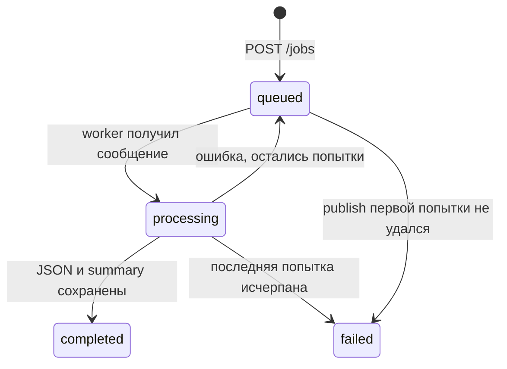

# API и модель заданий

Базовый адрес локального окружения: `http://localhost:3000`. API реализован в
[`src/api.ts`](../../src/api.ts).

## Endpoints

### `GET /health`

Проверяет соединение с PostgreSQL запросом `SELECT 1`.

Успешный ответ `200`:

```json
{ "status": "ok" }
```

Проверка не включает RabbitMQ и MinIO, поэтому `healthy` здесь означает только
работоспособность процесса API и БД.

### `POST /jobs`

Принимает `multipart/form-data`:

| Поле | Обязательность | Значение |
| --- | --- | --- |
| `file` | Да, ровно одно | MARC-файл |
| `encoding` | Нет | Имя кодировки `TextDecoder`, по умолчанию `utf-8` |

Ограничения multipart: один файл, до 10 текстовых полей, до 11 частей, размер
файла до `MAX_UPLOAD_BYTES`.

Успешный ответ `202`:

```json
{
  "jobId": "59d9dbe3-9179-47a3-ac79-66e46458b8f8",
  "status": "queued",
  "filename": "records.mrc",
  "encoding": "utf-8",
  "inputBytes": 12345,
  "summary": null,
  "error": null,
  "createdAt": "2026-08-21T10:00:00.000Z",
  "updatedAt": "2026-08-21T10:00:00.000Z"
}
```

Основные ошибки:

- `400` — нет файла, больше одного файла, неверное поле файла или кодировка;
- `413` — превышен лимит загрузки;
- `503` — файл и job созданы, но публикация в RabbitMQ не удалась; job получает
  статус `failed`;
- `500` — внутренняя ошибка, наружу возвращается нейтральный текст.

### `GET /jobs/:jobId`

Возвращает публичное представление job. Для `completed` добавляется
`resultUrl`.

- `400` — строка не похожа на UUID;
- `404` — job отсутствует;
- `200` — job найден.

### `GET /jobs/:jobId/result`

Для завершённого job потоково отдаёт объект из MinIO с `Content-Type:
application/json; charset=utf-8` и безопасным именем файла в
`Content-Disposition`.

- `409` — результат ещё не готов или job завершился ошибкой;
- `400`/`404` — те же условия, что у status endpoint;
- `200` — поток JSON.

## Жизненный цикл job



Статусы определены в [`job.ts`](../../src/job.ts). PostgreSQL хранит:

- идентификатор и статус;
- исходное имя, кодировку, размер и MinIO key входа;
- MinIO key и имя результата;
- JSONB summary;
- последнюю ошибку;
- `created_at` и `updated_at`.

## Статистика результата

После `completed` поле `summary` содержит:

| Поле | Значение |
| --- | --- |
| `recordsProcessed` | Всего выделенных и обработанных записей |
| `validRecords` | Записи без ошибок валидации и парсинга |
| `recordsWithValidationErrors` | Разобранные записи с одним или более нарушением |
| `recordsWithParsingErrors` | Записи, заменённые целиком на заглушку |
| `validationErrors` | Общее количество нарушений validation rules |
| `inputBytes` | Сумма длин обработанных MARC-записей |
| `durationMilliseconds` | Время работы конвертера |

Локальный `outputPath` из `MarcProcessingSummary` в БД не сохраняется.

## Queue contract

Сообщение содержит только:

```json
{
  "jobId": "59d9dbe3-9179-47a3-ac79-66e46458b8f8",
  "attempt": 1
}
```

Файл не проходит через RabbitMQ. Он уже лежит в MinIO, а worker находит все
метаданные по `jobId` в PostgreSQL. Сообщения persistent, queue durable,
публикация ожидает publisher confirm, consumer использует manual ack.

## Объекты MinIO

| Key | Содержимое |
| --- | --- |
| `inputs/<jobId>.mrc` | Исходная загрузка |
| `outputs/<jobId>.json` | Готовый результат |

Имя скачиваемого результата строится из basename исходного имени, расширение
заменяется на `.json`, а CR, LF и кавычки заменяются `_`.
