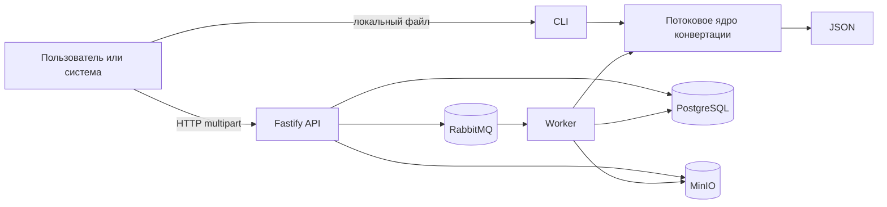
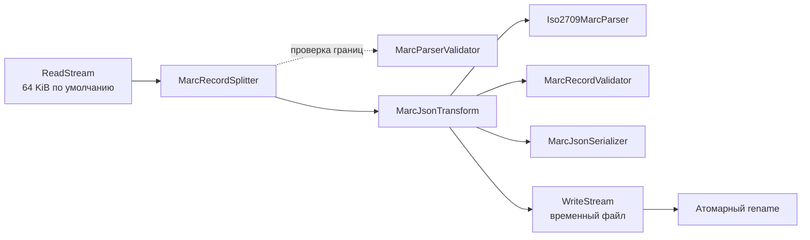

# Архитектура

## Контекст системы

Репозиторий содержит не три независимых реализации, а одно доменное ядро и
два адаптера запуска. CLI передаёт ядру локальные пути. API и worker добавляют
над ним очередь, постоянное состояние и объектное хранилище.

## Слои

| Слой | Ответственность | Основные модули |
| --- | --- | --- |
| Точки входа | Аргументы CLI, HTTP, жизненный цикл worker | [`cli.ts`](../../src/cli.ts), [`api.ts`](../../src/api.ts), [`worker.ts`](../../src/worker.ts) |
| Прикладная оркестрация | Сборка конвейера, временный и итоговый файл | [`marc-file-converter.ts`](../../src/marc-file-converter.ts) |
| MARC-домен | Framing, парсинг, модель и правила валидации | [`marc-record-splitter.ts`](../../src/marc-record-splitter.ts), [`marc-parser.ts`](../../src/marc-parser.ts), [`marc-record.ts`](../../src/marc-record.ts), [`marc-validator.ts`](../../src/marc-validator.ts) |
| Представление | JSON-форма, замены повреждённых данных, статистика и логи | [`marc-json-transform.ts`](../../src/marc-json-transform.ts), [`marc-json-serializer.ts`](../../src/marc-json-serializer.ts), [`marc-processing-logger.ts`](../../src/marc-processing-logger.ts) |
| Инфраструктура сервиса | PostgreSQL, RabbitMQ, MinIO, env-конфигурация | [`job-database.ts`](../../src/job-database.ts), [`job-queue.ts`](../../src/job-queue.ts), [`object-store.ts`](../../src/object-store.ts), [`service-config.ts`](../../src/service-config.ts) |

Зависимости направлены от точек входа к ядру и инфраструктурным адаптерам.
Потоковое ядро не знает о Fastify, RabbitMQ, PostgreSQL или MinIO, поэтому его
можно тестировать и запускать отдельно.

## Конвейер преобразования

[`convertMarcFile`](../../src/marc-file-converter.ts) — composition root этого
конвейера. Он создаёт конкретные реализации зависимостей и соединяет Node.js
streams через `pipeline`.

### Гарантии конвейера

- Backpressure обеспечивается стандартными Node.js streams.
- В памяти находится входной чанк, остаток `pending` и обрабатываемая запись,
  а не весь файл.
- Итог сначала пишется в уникальный временный файл с флагом `wx`.
- Только успешно завершённый поток публикуется атомарным `rename`.
- При фатальной ошибке временный файл удаляется, существующий итог не
  перезаписывается.
- Ошибка одной структурно разбираемой записи не обязательно останавливает
  весь файл: подробности приведены в [потоках данных](Data-flow.md).

## Модель MARC в памяти

[`MarcRecord`](../../src/marc-record.ts) состоит из:

- `byteLength` — фактической длины записи;
- `leader` — разобранного 24-байтового Leader и его исходной строки;
- `directory` — записей Directory с тегом, длиной и смещением;
- `fields` — контрольных полей `00x` или полей данных с двумя индикаторами и
  подполями.

Parser сохраняет значения полей как `Buffer`. Декодирование выбранной
пользователем кодировкой происходит только в serializer. Leader, Directory и
служебные числовые значения читаются как ASCII.

## Инфраструктура асинхронного сервиса

| Компонент | Хранимые данные | Гарантия в текущем коде |
| --- | --- | --- |
| PostgreSQL | Статус, метаданные файла, статистика, ошибка | Запись задания по UUID; таблица создаётся идемпотентно |
| RabbitMQ | `{ jobId, attempt }` | Durable queue, persistent messages, publisher confirms, manual ack |
| MinIO | `inputs/<jobId>.mrc`, `outputs/<jobId>.json` | Bucket создаётся при старте; передаются потоки, а не целые buffers |
| Локальная ФС | Временная копия входа и результата worker | Уникальный каталог в системном temp, удаление в `finally` |

Основной queue и dead-letter queue имеют имена `<RABBITMQ_QUEUE>` и
`<RABBITMQ_QUEUE>.dead`. Последняя попытка отклоняется без requeue и попадает в
dead-letter exchange.

## Осознанные компромиссы

- API сначала сохраняет multipart-загрузку во временный файл и только потом
  отправляет её в MinIO. Это упрощает передачу точного размера объекта, но
  требует дискового пространства размером с загрузку.
- Worker тоже материализует вход и результат на диске, потому что общее ядро
  принимает пути файлов.
- Схема БД встроена в `initialize`; для эволюции production-схемы понадобится
  отдельный механизм миграций.
- Статусы обновляются отдельными запросами без compare-and-set. Текущая модель
  рассчитана на корректную доставку сообщений RabbitMQ, но не реализует
  полноценную распределённую блокировку задания.
- Cleanup объектов и записей по TTL в коде отсутствует; это ответственность
  эксплуатации.
