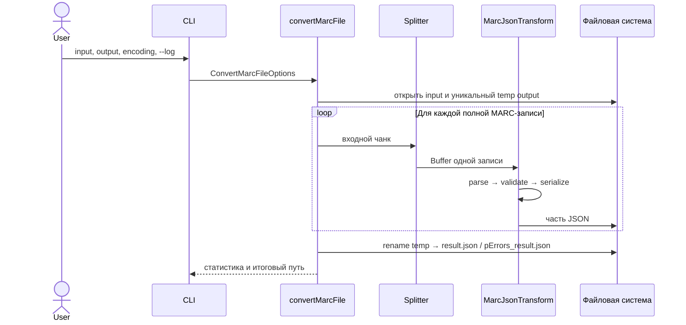
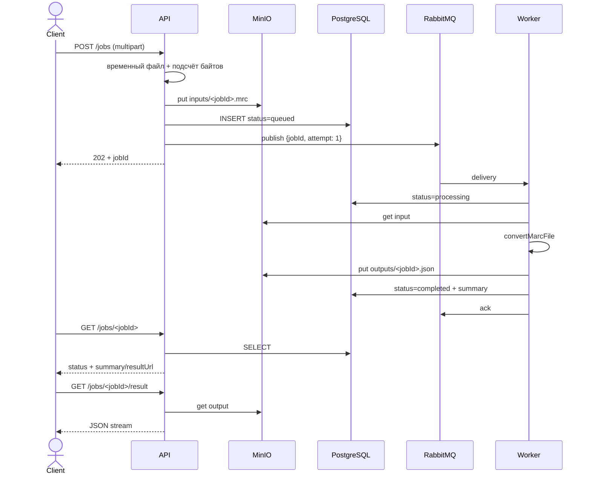

# Потоки данных и ошибок

## Локальная конвертация

CLI разбирает аргументы в [`cli.ts`](../../src/cli.ts) и передаёт управление
[`convertMarcFile`](../../src/marc-file-converter.ts). Расширение `.json`
добавляется автоматически. Префикс `pErrors_` добавляется только при наличии
ошибок парсинга отдельных записей.

## Разделение входного файла

[`MarcRecordSplitter`](../../src/marc-record-splitter.ts) накапливает байты в
`pending` и читает первые пять ASCII-цифр как полную длину записи. Когда байтов
достаточно, он:

1. вырезает одну запись;
2. формирует контекст `{ recordIndex, byteOffset }`;
3. вызывает [`MarcParserValidator`](../../src/marc-parser-validator.ts), который
   сверяет объявленную длину и терминатор записи `0x1D`;
4. передаёт `Buffer` дальше.

Некорректные пять байтов длины, длина меньше 25 байт, неверный терминатор или
незавершённый хвост файла считаются framing-ошибками и останавливают pipeline.

## Обработка одной записи

[`MarcJsonTransform`](../../src/marc-json-transform.ts) выполняет четыре шага:

1. [`Iso2709MarcParser`](../../src/marc-parser.ts) разбирает Leader, Directory и
   поля;
2. [`MarcRecordValidator`](../../src/marc-validator.ts) собирает все известные
   нарушения правил;
3. [`MarcJsonSerializer`](../../src/marc-json-serializer.ts) декодирует значения
   и заменяет только повреждённые части на `"<unrecognized>"`;
4. transform обновляет статистику и дописывает JSON без накопления массива
   объектов в памяти.

Особенность формы результата:

| Количество записей | Корневая JSON-форма |
| --- | --- |
| 0 | `[]` |
| 1 | объект записи |
| 2 и более | массив объектов |

## Классы ошибок

| Класс | Пример | Продолжение | Итог |
| --- | --- | --- | --- |
| Framing / фатальная I/O | неверная длина в первых 5 байтах, оборванный файл, ошибка записи | Нет | Временный файл удаляется, итог не публикуется |
| Parsing одной записи | Directory не кратна размеру entry, поле выходит за границы | Да | Заглушка всей записи, счётчик parsing errors, префикс `pErrors_` |
| Validation | неверный тег, индикатор или код подполя | Да | Точечные `"<unrecognized>"`, отдельные счётчики validation errors |
| Ошибка async job | MinIO, конвертация, сохранение результата | До `JOB_MAX_ATTEMPTS` | Повторная публикация или `failed` + dead-letter queue |

Правила и их связь с выходными полями подробно перечислены в
[документе валидации](../%D0%9F%D1%80%D0%B0%D0%B2%D0%B8%D0%BB%D0%B0%20%D0%B2%D0%B0%D0%BB%D0%B8%D0%B4%D0%B0%D1%86%D0%B8%D0%B8%20MARC%20%D0%B7%D0%B0%D0%BF%D0%B8%D1%81%D0%B8.md).

## Асинхронное задание

### Повторная попытка

При ошибке worker сначала фиксирует текст ошибки. Если номер попытки меньше
лимита, он переводит job обратно в `queued`, публикует новое сообщение с
`attempt + 1` и подтверждает старое. На последней попытке job становится
`failed`, а сообщение отклоняется и маршрутизируется в dead-letter queue.

Сообщение с некорректным UUID или номером попытки сразу отклоняется. Сообщение
для отсутствующего или уже завершённого job подтверждается без повторной
обработки.
